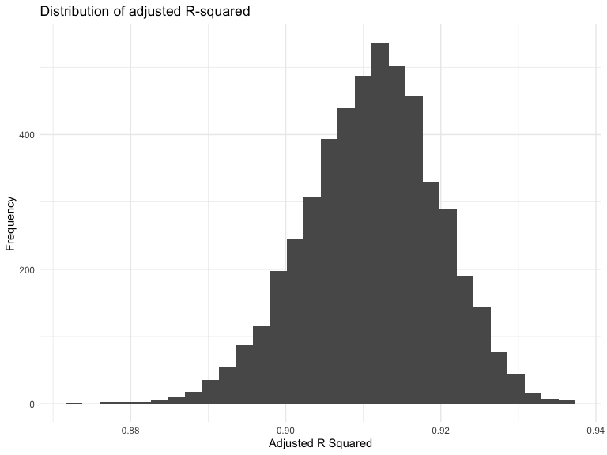
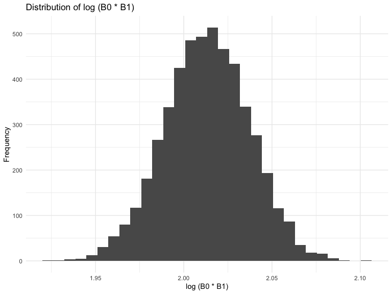

Homework 6
================

## Problem 1

``` r
weather_df = 
  rnoaa::meteo_pull_monitors(
    c("USW00094728"),
    var = c("PRCP", "TMIN", "TMAX"), 
    date_min = "2017-01-01",
    date_max = "2017-12-31") %>%
  mutate(
    name = recode(id, USW00094728 = "CentralPark_NY"),
    tmin = tmin / 10,
    tmax = tmax / 10) %>%
  select(name, id, everything())
```

    ## using cached file: /Users/lizy_choi/Library/Caches/org.R-project.R/R/rnoaa/noaa_ghcnd/USW00094728.dly

    ## date created (size, mb): 2024-10-29 11:14:06.133018 (8.656)

    ## file min/max dates: 1869-01-01 / 2024-10-31

``` r
set.seed(1)

bootstrap_weather = 
  weather_df %>%   
  modelr::bootstrap(n = 5000) %>% 
  mutate(
    models = map(strap, \(df) lm(tmax ~ tmin, data = df)),
    results = map(models, broom::tidy),
    fit = map(models, broom::glance))
```

``` r
bootstrap_results = 
  bootstrap_weather%>%
  unnest(results) %>% 
  select(term, estimate, fit) %>% 
  pivot_wider(
    names_from = term,
    values_from = estimate
  ) %>% 
  mutate(
    log_betas = log(`(Intercept)`* tmin)
  ) %>% 
  unnest(fit) %>% 
  select(log_betas, adj.r.squared)
```

## Plotting distribution of the estimate

``` r
bootstrap_results %>% 
  ggplot(aes(x = adj.r.squared)) + 
  geom_histogram() + 
  labs(
    title = "Distribution of adjusted R-squared",
    x = "Adjusted R Squared",
    y = "Frequency"
  )
```

    ## `stat_bin()` using `bins = 30`. Pick better value with `binwidth`.



``` r
bootstrap_results %>% 
  ggplot(aes(x = log_betas)) +
  geom_histogram()+
  labs(
    title = "Distribution of log (B0 * B1)",
    x = "log (B0 * B1)",
    y = "Frequency"
  )
```

    ## `stat_bin()` using `bins = 30`. Pick better value with `binwidth`.


We can observe that both of the plots, the adjusted R-squared and the
log (B0 \* B1) demonstrate normal distributions.

``` r
bootstrap_results %>%
  summarize(
    ci_lower_r2 = quantile(adj.r.squared, 0.025), 
    ci_upper_r2 = quantile(adj.r.squared, 0.975),
    ci_lower_betas = quantile(log_betas, 0.025), 
    ci_upper_betas = quantile(log_betas, 0.975)
  ) %>% 
  unite("adjusted R_squared confidence interval", ci_lower_r2:ci_upper_r2, sep = ", ") %>% 
  unite("log product of betas confidence interval", ci_lower_betas:ci_upper_betas, sep = ", ") %>% 
  knitr::kable()
```

| adjusted R_squared confidence interval | log product of betas confidence interval |
|:---|:---|
| 0.893375487712946, 0.92690515445239 | 1.9649486928301, 2.05888745920792 |

## Problem 2

``` r
homicide = read.csv("data/homicide-data.csv") %>% 
  unite("city_state", city:state, sep = ', ', na.rm = TRUE)%>% 
  mutate(
    city_state = str_replace(city_state, "Milwaukee, wI", "Milwaukee, WI"),
    victim_age = as.numeric(victim_age),
    unsolved = ifelse(disposition %in% c("Closed without arrest", "Open/No arrest"), 0, 1)
  ) %>% 
  filter(
    !(city_state %in% c("Dallas, TX", "Phoenix, AZ", "Kansas City, MO", "Tulsa, AL")),
    victim_race %in% c("White", "Black")
  )
```

## glm

``` r
baltimore =
  homicide %>% 
  filter(city_state == "Baltimore, MD") 

baltimore_glm = 
  baltimore%>% 
  glm(unsolved ~ victim_age + victim_race + victim_sex, data =., family = binomial()) %>% 
  broom::tidy(conf.int = TRUE) %>% 
  mutate(
    odds_ratio = exp(estimate)) %>% 
  select(term, log_odds_ratio = estimate, odds_ratio, conf.low, conf.high)
```

## each cities
