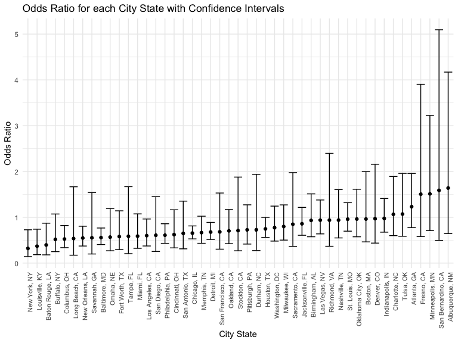
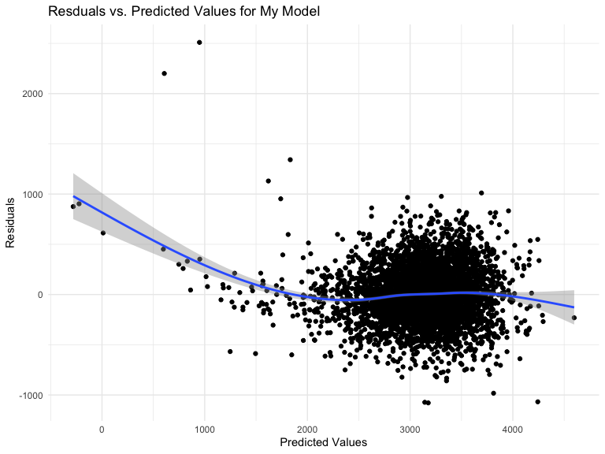
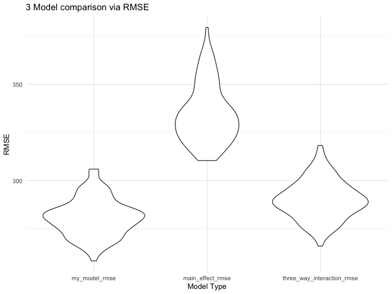

Homework 6
================

## Problem 1

``` r
weather_df = 
  rnoaa::meteo_pull_monitors(
    c("USW00094728"),
    var = c("PRCP", "TMIN", "TMAX"), 
    date_min = "2017-01-01",
    date_max = "2017-12-31") %>%
  mutate(
    name = recode(id, USW00094728 = "CentralPark_NY"),
    tmin = tmin / 10,
    tmax = tmax / 10) %>%
  select(name, id, everything())
```

    ## using cached file: /Users/lizychoi/Library/Caches/org.R-project.R/R/rnoaa/noaa_ghcnd/USW00094728.dly

    ## date created (size, mb): 2024-10-30 19:14:47.212289 (8.656)

    ## file min/max dates: 1869-01-01 / 2024-10-31

``` r
set.seed(1)

bootstrap_weather = 
  weather_df %>%   
  modelr::bootstrap(n = 5000) %>% 
  mutate(
    models = map(strap, \(df) lm(tmax ~ tmin, data = df)),
    results = map(models, broom::tidy),
    fit = map(models, broom::glance))
```

``` r
bootstrap_results = 
  bootstrap_weather%>%
  unnest(results) %>% 
  select(term, estimate, fit) %>% 
  pivot_wider(
    names_from = term,
    values_from = estimate
  ) %>% 
  mutate(
    log_betas = log(`(Intercept)`* tmin)
  ) %>% 
  unnest(fit) %>% 
  select(log_betas, adj.r.squared)
```

## Plotting distribution of the estimate

``` r
bootstrap_results %>% 
  ggplot(aes(x = adj.r.squared)) + 
  geom_histogram() + 
  labs(
    title = "Distribution of adjusted R-squared",
    x = "Adjusted R Squared",
    y = "Frequency"
  )
```

    ## `stat_bin()` using `bins = 30`. Pick better value with `binwidth`.


``` r
bootstrap_results %>% 
  ggplot(aes(x = log_betas)) +
  geom_histogram()+
  labs(
    title = "Distribution of log (B0 * B1)",
    x = "log (B0 * B1)",
    y = "Frequency"
  )
```

    ## `stat_bin()` using `bins = 30`. Pick better value with `binwidth`.


We can observe that both of the plots, the adjusted R-squared and the
log (B0 \* B1) demonstrate normal distributions.

``` r
bootstrap_results %>%
  summarize(
    ci_lower_r2 = quantile(adj.r.squared, 0.025), 
    ci_upper_r2 = quantile(adj.r.squared, 0.975),
    ci_lower_betas = quantile(log_betas, 0.025), 
    ci_upper_betas = quantile(log_betas, 0.975)
  ) %>% 
  unite("adjusted R_squared confidence interval", ci_lower_r2:ci_upper_r2, sep = ", ") %>% 
  unite("log product of betas confidence interval", ci_lower_betas:ci_upper_betas, sep = ", ") %>% 
  knitr::kable()
```

| adjusted R_squared confidence interval | log product of betas confidence interval |
|:---|:---|
| 0.893375487712946, 0.92690515445239 | 1.9649486928301, 2.05888745920792 |

## Problem 2

``` r
homicide = read.csv("data/homicide-data.csv") %>% 
  unite("city_state", city:state, sep = ', ', na.rm = TRUE) %>% 
  mutate(
    city_state = str_replace(city_state, "Milwaukee, wI", "Milwaukee, WI"),
    victim_age = as.numeric(victim_age),
    unsolved = ifelse(disposition == c("Closed without arrest", "Open/No arrest"), 0, 1)
  ) %>% 
  filter(
    !(city_state %in% c("Dallas, TX", "Phoenix, AZ", "Kansas City, MO", "Tulsa, AL")),
    victim_race %in% c("White", "Black"),
    !is.na(victim_age)
  ) 
```

## glm fpr Baltimore

``` r
baltimore =
  homicide %>% 
  filter(city_state == "Baltimore, MD") 

baltimore_glm = 
  baltimore %>% 
  glm(unsolved ~ victim_age + victim_sex + victim_race, data = ., family = binomial()) %>% 
  broom::tidy() %>% 
  filter(term == "victim_sexMale") %>% 
  mutate(
    OR = exp(estimate),
    CI_low = exp(estimate - 1.96 * std.error),
    CI_upper = exp(estimate + 1.96 * std.error)) %>% 
  select(term, log_OR = estimate, OR, CI_low, CI_upper) %>% 
  knitr::kable(digits = 3)
```

## each cities

``` r
glm_city = function(df) {
    glm(unsolved ~ victim_age + victim_race + victim_sex, data =df, family = binomial()) %>%
    broom::tidy() %>%
    mutate(
    OR = exp(estimate),
    CI_low = exp(estimate - 1.96 * std.error),
    CI_upper = exp(estimate + 1.96 * std.error)
    )
}

city_state_glm = 
  homicide %>% 
  select(city_state, unsolved, victim_race, victim_age, victim_sex) %>% 
  nest(data = unsolved:victim_sex) %>% 
  mutate(
    glm_result = map(data,glm_city)
    ) %>%
  unnest(glm_result) %>% 
  filter(term == "victim_sexMale") %>% 
  select(city_state,OR, CI_low, CI_upper)

city_state_glm %>% 
  knitr::kable(digits = 3)
```

| city_state         |    OR | CI_low | CI_upper |
|:-------------------|------:|-------:|---------:|
| Albuquerque, NM    | 1.639 |  0.644 |    4.170 |
| Atlanta, GA        | 1.231 |  0.774 |    1.958 |
| Baltimore, MD      | 0.557 |  0.406 |    0.766 |
| Baton Rouge, LA    | 0.396 |  0.180 |    0.871 |
| Birmingham, AL     | 0.932 |  0.575 |    1.511 |
| Boston, MA         | 0.962 |  0.463 |    1.999 |
| Buffalo, NY        | 0.517 |  0.250 |    1.072 |
| Charlotte, NC      | 1.065 |  0.600 |    1.891 |
| Chicago, IL        | 0.655 |  0.529 |    0.811 |
| Cincinnati, OH     | 0.622 |  0.332 |    1.164 |
| Columbus, OH       | 0.526 |  0.337 |    0.821 |
| Denver, CO         | 0.970 |  0.436 |    2.157 |
| Detroit, MI        | 0.677 |  0.516 |    0.888 |
| Durham, NC         | 0.727 |  0.273 |    1.938 |
| Fort Worth, TX     | 0.580 |  0.295 |    1.141 |
| Fresno, CA         | 1.504 |  0.580 |    3.904 |
| Houston, TX        | 0.747 |  0.559 |    0.999 |
| Indianapolis, IN   | 0.976 |  0.675 |    1.411 |
| Jacksonville, FL   | 0.859 |  0.607 |    1.216 |
| Las Vegas, NV      | 0.937 |  0.638 |    1.378 |
| Long Beach, CA     | 0.536 |  0.172 |    1.666 |
| Los Angeles, CA    | 0.600 |  0.374 |    0.963 |
| Louisville, KY     | 0.369 |  0.184 |    0.740 |
| Memphis, TN        | 0.665 |  0.432 |    1.024 |
| Miami, FL          | 0.589 |  0.323 |    1.075 |
| Milwaukee, WI      | 0.799 |  0.502 |    1.271 |
| Minneapolis, MN    | 1.512 |  0.709 |    3.223 |
| Nashville, TN      | 0.939 |  0.549 |    1.605 |
| New Orleans, LA    | 0.548 |  0.373 |    0.804 |
| New York, NY       | 0.320 |  0.141 |    0.727 |
| Oakland, CA        | 0.704 |  0.424 |    1.169 |
| Oklahoma City, OK  | 0.962 |  0.574 |    1.612 |
| Omaha, NE          | 0.567 |  0.269 |    1.193 |
| Philadelphia, PA   | 0.609 |  0.432 |    0.859 |
| Pittsburgh, PA     | 0.727 |  0.415 |    1.272 |
| Richmond, VA       | 0.938 |  0.367 |    2.397 |
| San Antonio, TX    | 0.649 |  0.311 |    1.352 |
| Sacramento, CA     | 0.848 |  0.364 |    1.975 |
| Savannah, GA       | 0.553 |  0.199 |    1.543 |
| San Bernardino, CA | 1.588 |  0.495 |    5.095 |
| San Diego, CA      | 0.607 |  0.254 |    1.450 |
| San Francisco, CA  | 0.682 |  0.304 |    1.530 |
| St. Louis, MO      | 0.959 |  0.697 |    1.319 |
| Stockton, CA       | 0.710 |  0.269 |    1.878 |
| Tampa, FL          | 0.586 |  0.206 |    1.669 |
| Tulsa, OK          | 1.071 |  0.585 |    1.959 |
| Washington, DC     | 0.773 |  0.480 |    1.244 |

## Plotting Oddds Ratio of Each City State

``` r
city_state_glm %>% 
  ggplot(aes(x= reorder(city_state, OR), y = OR))+
  geom_point()+
  geom_errorbar(aes(ymin= CI_low, max = CI_upper)) +
  theme(
    axis.text.x = element_text(angle = 90, vjust =1, hjust = 1, size = 8)) +
  labs(
    title = "Odds Ratio for each City State with Confidence Intervals",
    x = "City State",
    y = "Odds Ratio"
  )
```



# Problem 3

``` r
birthweight = read_csv("data/birthweight.csv") %>% 
  janitor::clean_names() %>% 
  mutate(
    babysex = factor(babysex, labels = c("Male", "Female"), levels = c(1,2)),
    frace = factor(frace, labels = c("White", "Black", "Asian", "Puerto Rican", "Other", "Unknown"), levels = c(1,2,3,4,8,9)),
    malform = factor(malform, labels = c("absent", "present"), levels = c(0,1)),
    mrace = factor(mrace, labels= c("White", "Black", "Asian", "Puerto Rican", "Other"), levels = c(1,2,3,4,8))
  )
```

    ## Rows: 4342 Columns: 20
    ## ── Column specification ────────────────────────────────────────────────────────
    ## Delimiter: ","
    ## dbl (20): babysex, bhead, blength, bwt, delwt, fincome, frace, gaweeks, malf...
    ## 
    ## ℹ Use `spec()` to retrieve the full column specification for this data.
    ## ℹ Specify the column types or set `show_col_types = FALSE` to quiet this message.

``` r
sum(is.na(birthweight))
```

    ## [1] 0

Based on this result, 0,all the values seem to be present.

## My birthweight model

``` r
birthweight_lm = 
  birthweight %>% 
  lm(bwt ~babysex + bhead + blength + ppbmi +  gaweeks + momage + delwt, data = .)
summary(birthweight_lm)
```

    ## 
    ## Call:
    ## lm(formula = bwt ~ babysex + bhead + blength + ppbmi + gaweeks + 
    ##     momage + delwt, data = .)
    ## 
    ## Residuals:
    ##      Min       1Q   Median       3Q      Max 
    ## -1078.66  -185.10    -8.49   173.16  2509.92 
    ## 
    ## Coefficients:
    ##                 Estimate Std. Error t value Pr(>|t|)    
    ## (Intercept)   -6191.8890    99.6711 -62.123  < 2e-16 ***
    ## babysexFemale    32.6793     8.6660   3.771 0.000165 ***
    ## bhead           136.5103     3.5113  38.878  < 2e-16 ***
    ## blength          78.0108     2.0609  37.853  < 2e-16 ***
    ## ppbmi           -14.3684     1.9485  -7.374 1.97e-13 ***
    ## gaweeks          12.5869     1.4893   8.451  < 2e-16 ***
    ## momage            5.8343     1.1090   5.261 1.50e-07 ***
    ## delwt             3.5094     0.2866  12.245  < 2e-16 ***
    ## ---
    ## Signif. codes:  0 '***' 0.001 '**' 0.01 '*' 0.05 '.' 0.1 ' ' 1
    ## 
    ## Residual standard error: 279.9 on 4334 degrees of freedom
    ## Multiple R-squared:  0.7017, Adjusted R-squared:  0.7012 
    ## F-statistic:  1457 on 7 and 4334 DF,  p-value: < 2.2e-16

The summary of the linear model suggests that all the variables selected
were statistically significant predictors of `birthweight.` The adjusted
R-squared demonstrates to be 0.7012.

``` r
birthweight = 
  birthweight %>% 
  modelr::add_predictions(birthweight_lm) %>% 
  modelr::add_residuals(birthweight_lm)
```

``` r
birthweight %>% 
  ggplot(aes(x = pred, y = resid)) + 
  geom_point() +
  geom_smooth() +
  labs(
    title = "Resduals vs. Predicted Values for My Model",
    x = "Predicted Values", 
    y = "Residuals"
  )
```

    ## `geom_smooth()` using method = 'gam' and formula = 'y ~ s(x, bs = "cs")'



\#comparing my moel to main effects and other models

``` r
main_effects =
  birthweight %>% 
  lm(bwt ~ blength +gaweeks, data = .)

three_way_interaction = 
  birthweight %>% 
  lm(bwt ~ bhead * blength * babysex, data =. )

summary(main_effects)
```

    ## 
    ## Call:
    ## lm(formula = bwt ~ blength + gaweeks, data = .)
    ## 
    ## Residuals:
    ##     Min      1Q  Median      3Q     Max 
    ## -1709.6  -215.4   -11.4   208.2  4188.8 
    ## 
    ## Coefficients:
    ##              Estimate Std. Error t value Pr(>|t|)    
    ## (Intercept) -4347.667     97.958  -44.38   <2e-16 ***
    ## blength       128.556      1.990   64.60   <2e-16 ***
    ## gaweeks        27.047      1.718   15.74   <2e-16 ***
    ## ---
    ## Signif. codes:  0 '***' 0.001 '**' 0.01 '*' 0.05 '.' 0.1 ' ' 1
    ## 
    ## Residual standard error: 333.2 on 4339 degrees of freedom
    ## Multiple R-squared:  0.5769, Adjusted R-squared:  0.5767 
    ## F-statistic:  2958 on 2 and 4339 DF,  p-value: < 2.2e-16

``` r
summary(three_way_interaction)
```

    ## 
    ## Call:
    ## lm(formula = bwt ~ bhead * blength * babysex, data = .)
    ## 
    ## Residuals:
    ##      Min       1Q   Median       3Q      Max 
    ## -1132.99  -190.42   -10.33   178.63  2617.96 
    ## 
    ## Coefficients:
    ##                               Estimate Std. Error t value Pr(>|t|)    
    ## (Intercept)                 -7176.8170  1264.8397  -5.674 1.49e-08 ***
    ## bhead                         181.7956    38.0542   4.777 1.84e-06 ***
    ## blength                       102.1269    26.2118   3.896 9.92e-05 ***
    ## babysexFemale                6374.8684  1677.7669   3.800 0.000147 ***
    ## bhead:blength                  -0.5536     0.7802  -0.710 0.478012    
    ## bhead:babysexFemale          -198.3932    51.0917  -3.883 0.000105 ***
    ## blength:babysexFemale        -123.7729    35.1185  -3.524 0.000429 ***
    ## bhead:blength:babysexFemale     3.8781     1.0566   3.670 0.000245 ***
    ## ---
    ## Signif. codes:  0 '***' 0.001 '**' 0.01 '*' 0.05 '.' 0.1 ' ' 1
    ## 
    ## Residual standard error: 287.7 on 4334 degrees of freedom
    ## Multiple R-squared:  0.6849, Adjusted R-squared:  0.6844 
    ## F-statistic:  1346 on 7 and 4334 DF,  p-value: < 2.2e-16

# comparison between my model and other models via corss-validated prediction error

``` r
cv = 
  crossv_mc(birthweight, 100) %>% 
  mutate(
    train = map(train, as_tibble),
    test = map(test, as_tibble)
  )
cv_results = 
  cv %>% 
  mutate(
    my_model = map(train, \(df) lm(bwt ~babysex + bhead + blength + ppbmi +  gaweeks + momage + delwt, data = df)),
    main_effect_model = map(train, \(df) lm(bwt ~ blength +gaweeks, data = df)),
    three_way_interaction_model = map(train, \(df) lm(bwt ~ bhead * blength * babysex, data =df))
  ) %>% 
  mutate(
    my_model_rmse = map2_dbl(my_model, test, rmse),
    main_effect_rmse = map2_dbl(main_effect_model, test, rmse),
    three_way_interaction_rmse = map2_dbl(three_way_interaction_model, test, rmse)
  )
```

\#RMSE comparison of the different models

``` r
cv_results %>% 
  select(contains("rmse")) %>% 
  pivot_longer(everything(),
               names_to = "model",
               values_to = "rmse",
               names_prefix = "rmse ") %>% 
  mutate(model = fct_inorder(model)) %>% 
  ggplot(aes(x = model, y = rmse)) +
  geom_violin()+
  labs(
    title = "3 Model comparison via RMSE",
    x = "Model Type",
    y = "RMSE"
  )
```



Through the violin plot, we can observe that the `main_effect_model`
demonstrates the highest RMSE, indicating poor fit. `my_model` suggests
to have the lowest RMSE, though it is not a significantly different from
`three_way_interaction_model`.
